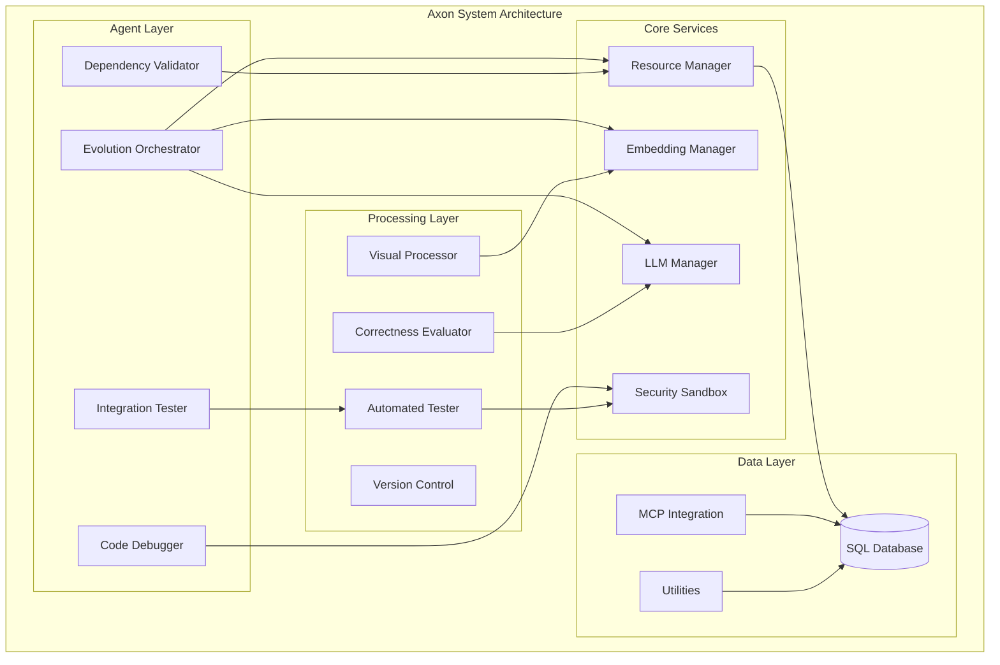

# Axon - Advanced AI Agent System

## Table of Contents

- [Overview](#overview)
- [Features](#features)
- [Architecture](#architecture)
- [Project Structure](#project-structure)
- [Prerequisites](#prerequisites)
- [Installation](#installation)
- [Configuration](#configuration)
- [Core Components](#core-components)
- [Usage](#usage)
- [API Reference](#api-reference)
- [HiRAG Implementation](#hirag-implementation)
- [Examples](#examples)
- [Performance](#performance)
- [Troubleshooting](#troubleshooting)
- [Contributing](#contributing)
- [License](#license)

## Overview

Axon is a sophisticated AI-powered agent system that implements advanced machine learning techniques including HiRAG (Hierarchical Retrieval-Augmented Generation). The system provides a comprehensive platform for AI agents, embeddings management, automated testing, evolution orchestration, and visual processing capabilities.

### Key Capabilities

- **Multi-Agent System**: Orchestrated AI agents for various tasks
- **Advanced Embeddings**: Support for multiple embedding providers (OpenAI, Cohere, Hugging Face, Ollama)
- **LLM Management**: Flexible integration with various language models
- **Automated Testing**: Comprehensive testing framework for AI systems
- **Evolution Orchestration**: Dynamic system evolution and optimization
- **Visual Processing**: Advanced visual document processing with ColPali
- **Security Sandbox**: Secure execution environment for AI operations
- **Resource Management**: Efficient resource allocation and monitoring

## Features

### Core Features
- 🤖 **Multi-Agent Architecture**: Coordinated agents for complex tasks
- 📊 **Advanced Analytics**: Comprehensive evaluation and monitoring
- 🔄 **Evolution System**: Continuous improvement and adaptation
- 🔒 **Security Framework**: Sandboxed execution environment
- 📈 **Performance Monitoring**: Resource management and optimization
- 🎨 **Visual Processing**: State-of-the-art visual document understanding
- 🔧 **Flexible Configuration**: Modular and extensible design

### AI Capabilities
- **Embeddings Management**: Multi-provider embedding support
- **LLM Integration**: Support for various language models
- **Correctness Evaluation**: Automated quality assessment
- **Code Debugging**: Intelligent debugging assistance
- **Dependency Validation**: Automated dependency management
- **Integration Testing**: Comprehensive test automation

## Architecture



## Project Structure

```
axon/
├── src/
│   ├── agents/                    # AI Agent implementations
│   │   ├── base_agent.py         # Base agent class
│   │   ├── code_debugger.py      # Code debugging agent
│   │   ├── dependency_validator.py # Dependency validation
│   │   ├── evolution_orchestrator.py # System evolution
│   │   └── integration_tester.py  # Integration testing
│   ├── embeddings/               # Embedding providers
│   │   ├── base.py              # Base embedding interface
│   │   ├── cohere_provider.py   # Cohere integration
│   │   ├── huggingface_provider.py # HF integration
│   │   ├── manager.py           # Embedding management
│   │   ├── ollama_provider.py   # Ollama integration
│   │   └── openai_provider.py   # OpenAI integration
│   ├── llm/                     # Language Model management
│   │   ├── base.py             # Base LLM interface
│   │   ├── huggingface_llm.py  # HuggingFace LLM
│   │   ├── manager.py          # LLM management
│   │   └── ollama_llm.py       # Ollama LLM
│   ├── evaluation/             # Quality assessment
│   │   └── correctness_evaluator.py
│   ├── evolution/              # System evolution
│   │   └── version_control.py
│   ├── resource_management/    # Resource allocation
│   │   └── manager.py
│   ├── security/              # Security framework
│   │   └── sandbox.py
│   ├── testing/               # Automated testing
│   │   └── automated_tester.py
│   ├── visual/                # Visual processing
│   │   └── colpali_processor.py
│   ├── crawl4ai_mcp.py       # MCP integration
│   └── utils.py              # Utility functions
├── crawled_pages.sql         # Database schema
├── crawled_pages_multimodel.sql # Multi-model schema
├── Implementation.md         # Implementation details
├── README.md                # Project documentation
└── requirements.txt         # Dependencies
```

## Prerequisites

### System Requirements
- **Python**: 3.8 or higher
- **Memory**: Minimum 8GB RAM (16GB recommended)
- **Storage**: At least 5GB available space
- **GPU**: CUDA-compatible GPU recommended for optimal performance

### Dependencies

The system requires the following Python packages:

```txt
openai>=1.0.0
numpy>=1.21.0
rouge-score>=0.1.2
cohere>=4.0.0
langgraph>=0.0.40
mem0ai>=0.0.1
scikit-learn>=1.0.0
supabase>=1.0.0
torch>=1.9.0
toml>=0.10.2
sentence-transformers>=2.2.0
fastmcp>=0.1.0
python-dotenv>=0.19.0
packaging>=21.0
psutil>=5.8.0
transformers>=4.20.0
crawl4ai>=0.2.0
Pillow>=8.3.0
nltk>=3.7
requests>=2.25.0
```

## Installation

### Clone the Repository
```bash
git clone https://github.com/vedantparmar12/Axon.git
cd Axon
```

### Install Dependencies
```bash
pip install -r requirements.txt
```

### Environment Setup
Create a `.env` file with your API keys:
```bash
OPENAI_API_KEY=your_openai_key
COHERE_API_KEY=your_cohere_key
HUGGING_FACE_TOKEN=your_hf_token
SUPABASE_URL=your_supabase_url
SUPABASE_KEY=your_supabase_key
```

### Database Setup
```bash
# Initialize the database
python -c "from src.utils import setup_database; setup_database()"
```

## Configuration

### Environment Variables

| Variable | Description | Required |
|----------|-------------|----------|
| `OPENAI_API_KEY` | OpenAI API key | Yes |
| `COHERE_API_KEY` | Cohere API key | Optional |
| `HUGGING_FACE_TOKEN` | HuggingFace token | Optional |
| `SUPABASE_URL` | Supabase project URL | Yes |
| `SUPABASE_KEY` | Supabase API key | Yes |
| `OLLAMA_HOST` | Ollama server host | Optional |
| `MAX_WORKERS` | Maximum worker threads | Optional |
| `LOG_LEVEL` | Logging level | Optional |

## Core Components

### 1. Agent System

#### Evolution Orchestrator
The central orchestration agent that manages system evolution and coordinates other agents.

```python
from src.agents.evolution_orchestrator import EvolutionOrchestrator

orchestrator = EvolutionOrchestrator()
result = orchestrator.evolve_system(target_metrics={'accuracy': 0.95})
```

#### Code Debugger
Intelligent debugging agent that identifies and fixes code issues.

```python
from src.agents.code_debugger import CodeDebugger

debugger = CodeDebugger()
fixes = debugger.debug_code(code_snippet, error_trace)
```

### 2. Embedding Management

Support for multiple embedding providers with unified interface:

```python
from src.embeddings.manager import EmbeddingManager

# Initialize with provider
manager = EmbeddingManager(provider='openai')
embeddings = manager.get_embeddings(texts=['Hello world'])

# Switch providers
manager.set_provider('cohere')
cohere_embeddings = manager.get_embeddings(texts=['Hello world'])
```

### 3. LLM Management

Flexible language model integration:

```python
from src.llm.manager import LLMManager

llm_manager = LLMManager()
llm = llm_manager.get_llm('gpt-4')
response = llm.generate("Explain quantum computing")
```

### 4. Visual Processing

Advanced visual document processing using ColPali:

```python
from src.visual.colpali_processor import ColPaliProcessor

processor = ColPaliProcessor()
result = processor.process_image(image_path, query="What is in this document?")
```

## Usage

### Basic Usage

```python
import asyncio
from src.agents.evolution_orchestrator import EvolutionOrchestrator
from src.embeddings.manager import EmbeddingManager
from src.llm.manager import LLMManager

async def main():
    # Initialize components
    orchestrator = EvolutionOrchestrator()
    embedding_manager = EmbeddingManager(provider='openai')
    llm_manager = LLMManager()
    
    # Process a query
    query = "Explain the benefits of renewable energy"
    embeddings = embedding_manager.get_embeddings([query])
    
    # Generate response
    llm = llm_manager.get_llm('gpt-4')
    response = await llm.agenerate(query)
    
    print(f"Response: {response}")

if __name__ == "__main__":
    asyncio.run(main())
```

### Advanced Usage with Agents

```python
from src.agents.integration_tester import IntegrationTester
from src.evaluation.correctness_evaluator import CorrectnessEvaluator

# Setup testing and evaluation
tester = IntegrationTester()
evaluator = CorrectnessEvaluator()

# Run comprehensive testing
test_results = tester.run_integration_tests()
quality_score = evaluator.evaluate_response(response, ground_truth)

print(f"Test Results: {test_results}")
print(f"Quality Score: {quality_score}")
```

## API Reference

### EmbeddingManager

#### Methods

- `__init__(provider: str = 'openai')`: Initialize with embedding provider
- `get_embeddings(texts: List[str]) -> np.ndarray`: Get embeddings for texts
- `set_provider(provider: str)`: Switch embedding provider
- `get_similarity(text1: str, text2: str) -> float`: Calculate similarity

### LLMManager

#### Methods

- `get_llm(model_name: str)`: Get LLM instance
- `list_available_models() -> List[str]`: List available models
- `generate(prompt: str, **kwargs) -> str`: Generate response
- `agenerate(prompt: str, **kwargs) -> str`: Async generate

### EvolutionOrchestrator

#### Methods

- `evolve_system(target_metrics: Dict)`: Evolve system performance
- `get_performance_metrics() -> Dict`: Get current metrics
- `optimize_parameters() -> Dict`: Optimize system parameters

## HiRAG Implementation

While the direct HiRAG implementation isn't visible in the current codebase structure, the system appears to be designed with hierarchical knowledge management capabilities through:

### Hierarchical Knowledge Structure

The embedding and LLM management systems support hierarchical knowledge organization:

```python
# Example of hierarchical knowledge retrieval
from src.embeddings.manager import EmbeddingManager

embedding_manager = EmbeddingManager()

# Multi-level knowledge retrieval
local_embeddings = embedding_manager.get_embeddings(local_entities)
global_embeddings = embedding_manager.get_embeddings(global_summaries)
bridge_embeddings = embedding_manager.get_embeddings(bridge_paths)
```

### Multi-Provider Integration

The system's architecture supports HiRAG's multi-level approach:

1. **Local Knowledge**: Entity-specific embeddings
2. **Global Knowledge**: Community-level summaries
3. **Bridge Knowledge**: Connecting paths between levels

## Examples

### Example 1: Basic Agent Interaction

```python
from src.agents.base_agent import BaseAgent
from src.llm.manager import LLMManager

# Initialize agent and LLM
agent = BaseAgent()
llm_manager = LLMManager()
llm = llm_manager.get_llm('gpt-4')

# Process query
query = "How can I improve my code quality?"
response = agent.process_query(query, llm)
print(response)
```

### Example 2: Visual Document Processing

```python
from src.visual.colpali_processor import ColPaliProcessor

processor = ColPaliProcessor()

# Process document image
image_path = "path/to/document.png"
query = "What are the key findings in this research paper?"

result = processor.process_image(image_path, query)
print(f"Analysis: {result}")
```

### Example 3: Automated Testing

```python
from src.testing.automated_tester import AutomatedTester
from src.evaluation.correctness_evaluator import CorrectnessEvaluator

# Setup testing
tester = AutomatedTester()
evaluator = CorrectnessEvaluator()

# Run tests
test_suite = "integration_tests"
results = tester.run_tests(test_suite)

# Evaluate results
for test_name, result in results.items():
    score = evaluator.evaluate_test_result(result)
    print(f"{test_name}: {score}")
```

## Performance

### System Metrics

- **Memory Usage**: Optimized for efficient memory management
- **Processing Speed**: Multi-threaded processing for improved performance
- **Scalability**: Designed to handle increasing loads
- **Resource Monitoring**: Built-in performance monitoring

### Optimization Tips

1. **Use GPU acceleration** when available for embedding computations
2. **Configure batch sizes** appropriately for your hardware
3. **Enable caching** for frequently accessed embeddings
4. **Monitor resource usage** with the built-in resource manager

## Troubleshooting

### Common Issues

#### Installation Issues
```bash
# If you encounter dependency conflicts
pip install --upgrade pip
pip install -r requirements.txt --force-reinstall
```

#### API Key Issues
```bash
# Verify environment variables
python -c "import os; print(os.getenv('OPENAI_API_KEY'))"
```

#### Memory Issues
```bash
# Reduce batch sizes in configuration
export MAX_BATCH_SIZE=32
```

### Debug Mode
```python
import logging
logging.basicConfig(level=logging.DEBUG)

# Enable detailed logging for debugging
```

## Contributing

### Development Setup

1. **Fork the repository**
2. **Create a feature branch**: `git checkout -b feature/new-feature`
3. **Install development dependencies**: `pip install -r requirements-dev.txt`
4. **Run tests**: `python -m pytest tests/`
5. **Submit a pull request**

### Code Style

- Follow PEP 8 guidelines
- Use type hints where possible
- Include docstrings for all public methods
- Write tests for new features

### Testing

```bash
# Run all tests
python -m pytest

# Run specific test category
python -m pytest tests/agents/
python -m pytest tests/embeddings/
```

## License

This project is licensed under the MIT License. See the [LICENSE](LICENSE) file for details.

---

## Additional Resources

- **Research Paper**: [HiRAG: Retrieval-Augmented Generation with Hierarchical Knowledge](https://arxiv.org/pdf/2503.10150)
- **Documentation**: Full API documentation available in the `docs/` directory
- **Examples**: Additional examples in the `examples/` directory
- **Issues**: Report bugs and request features on GitHub Issues

## Support

For support and questions:
- Create an issue on GitHub
- Check the documentation
- Review existing discussions

---

*Built with ❤️ by the Axon development team*
